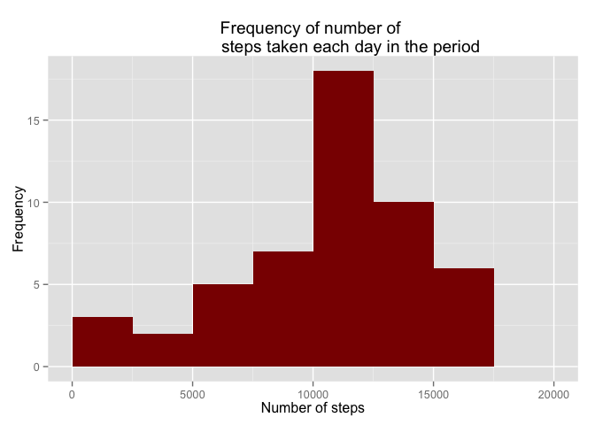
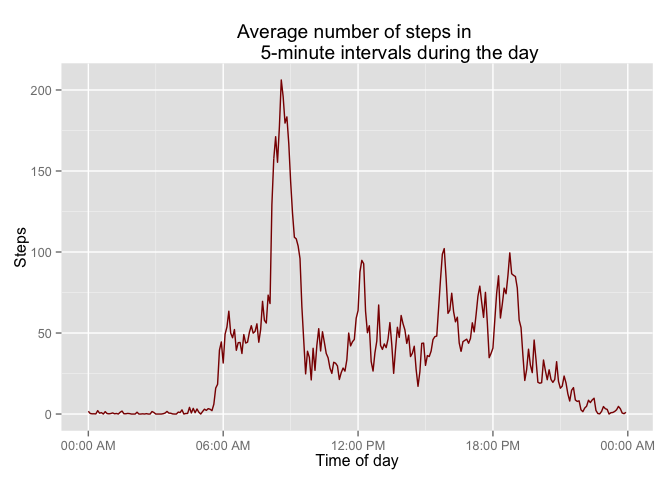
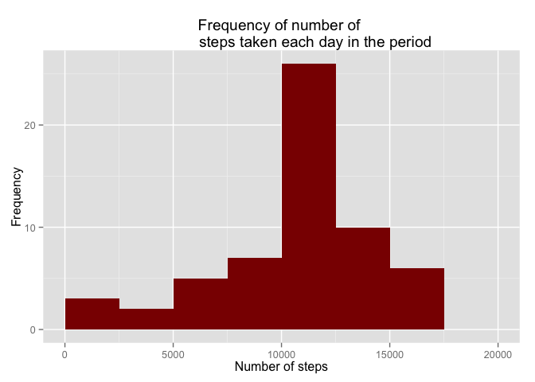

# Reproducible Research: Peer Assessment 1


## Loading and preprocessing the data

```r
## load necessary packages
library(plyr)
library(ggplot2)
library(scales)
## Load data
ActivityData <- read.csv("./activity.csv")
## Merge date and interval variables
ActivityData <- transform(ActivityData, rday = strptime( paste(date,
                        formatC(interval,width=4,flag="0")), "%Y-%m-%d %H%M"),tday = strptime( paste("1970-01-01",
                        formatC(interval,width=4,flag="0")), "%Y-%m-%d %H%M"))
```


## What is mean total number of steps taken per day?

```r
sumAD <- ddply(ActivityData, 'date', summarize, sumsteps = sum(steps))
fr <- ggplot(sumAD, aes(sumsteps))
fr <- fr + geom_histogram(binwidth=2500,fill="darkred")
fr <- fr + scale_x_continuous(limits=c(0,20000))
fr <- fr + labs(y="Frequency",x="Number of steps", title="Frequency of number of 
                steps taken each day in the period")
print(fr)
```

 


```r
meanAD <- as.integer(mean(sumAD$sumsteps,na.rm=TRUE)) # calc the daily mean steps
medAD <- median(sumAD$sumsteps,na.rm=TRUE)
```
During the period the mean number of steps per day was 10766 and the median 
was 10765.

## What is the average daily activity pattern?

```r
## Time series line graph
aveAD <- aggregate(steps ~ tday , ActivityData, FUN=mean)
ts <- ggplot(aveAD, aes(tday,steps))
ts <- ts + geom_line(color="darkred")
ts <- ts + scale_x_datetime(labels=date_format("%H:%M %p"))
ts <- ts + labs(y="Steps",x="Time of day", title="Average number of steps in 
                5-minute intervals during the day")
print(ts)
```

 


```r
## find the time ehen max number of steps is taken
ms<-aveAD[which.max(aveAD$steps),]
mm<-strftime(ms$tday, format="%H:%M %p")
mmax<-as.integer(ms$steps)
```
The 5/minute interval when the largest average number of steps (206) were measured 
happened at 08:35 AM 

## Inputing missing values


```r
numbermissing<-sum(is.na(ActivityData$steps))
```
The dataset has 2304 rows that are missing values. We will attempt 
to clear up this dataset by replacing the missing values with the mean for the 
same interval, taken over the other days.


```r
ActivityData2 <- ActivityData # Make a copy of dataset
aveADint <- aggregate(steps ~ interval , ActivityData2, FUN=mean)
## Loop through step column and replace NA with previously calc averages
for (i in 1:nrow(ActivityData2)) {
      if (is.na(ActivityData2[i,"steps"])) {
            rint<-ActivityData2[i,"interval"]
            ind <- which(rint == aveADint[,"interval"])
            ActivityData2[i,"steps"] <- aveADint[ind , "steps"]            
            } 
      }
```


```r
numbermissing<-sum(is.na(ActivityData2$steps))
```
The recoded dataset now has 0 rows that are missing values. 

### Plotting the recoded dataset with same settings as before

```r
sumAD <- ddply(ActivityData2, 'date', summarize, sumsteps = sum(steps))
fr <- ggplot(sumAD, aes(sumsteps))
fr <- fr + geom_histogram(binwidth=2500,fill="darkred")
fr <- fr + scale_x_continuous(limits=c(0,20000))
fr <- fr + labs(y="Frequency",x="Number of steps", title="Frequency of number of 
                steps taken each day in the period")
print(fr)
```

 


```r
meanAD <- as.integer(mean(sumAD$sumsteps,na.rm=TRUE)) # calc the daily mean steps
medAD <- as.integer(median(sumAD$sumsteps,na.rm=TRUE))
```
During the period the mean number of steps per day was 10766 and the median 
was 10766.
We can see that the mean number of steps is unchanged from the initial datset, and that the median changed with one step, out of over 10,000 steps. The difference seems acceptable.


## Are there differences in activity patterns between weekdays and weekends?

First code a new column for Weekday/Weekend.

```r
#Loop is slow, but it works, betetr replace with dplyr, or lapply
for (i in 1:nrow(ActivityData2 )) {
    if ( weekdays(as.Date(ActivityData2$date[i], "%Y-%m-%d")) %in% c("Friday","Saturday", "Sunday") ) {
        ActivityData2[i,"wdayfact"] = "weekend"
    } else {
        ActivityData2[i,"wdayfact"] = "weekday"
    }
}
ActivityData2$wdayfact <- as.factor(ActivityData2$wdayfact)
```
Plot a Split graph

```r
aveADW <- aggregate(ActivityData2$steps ,list(ActivityData2$wdayfact,ActivityData2$tday), FUN=mean)
names(aveADW)<-c("wdayfact","tday","avesteps")

ts <- ggplot(aveADW, aes(x=tday,y=avesteps))
ts <- ts + facet_grid(wdayfact~. )
ts <- ts + geom_line(color="darkred")
ts <- ts + scale_x_datetime(labels=date_format("%H:%M %p"))
ts <- ts + labs(y="Steps",x="Time of day", title="Average number of steps in 5-minute intervals during the day
               split on weekend or weekday")
print(ts)
```

 
